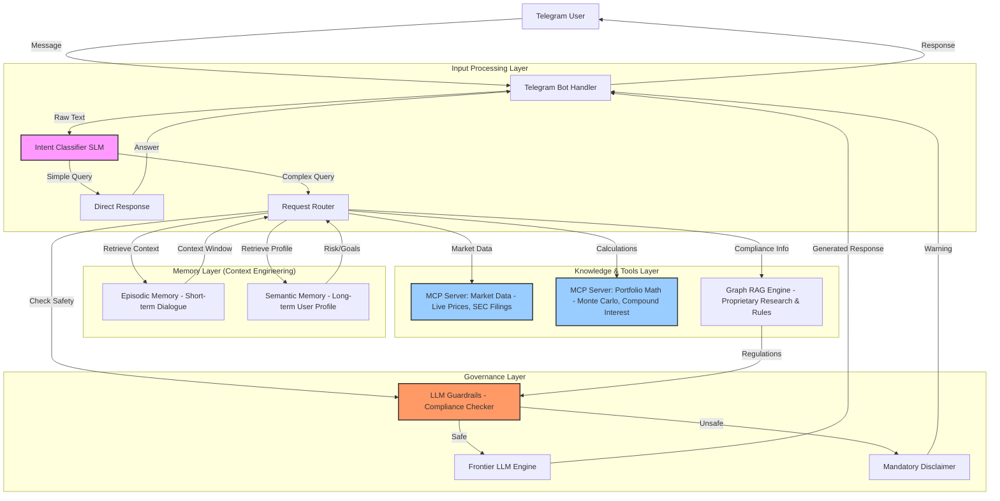

# Wealth & Portfolio Conversational Co-Pilot

A multi-turn financial assistant for retail banking or wealth management clients, deployed as a Telegram bot. It discusses market trends, explains complex financial concepts, analyzes user portfolios, and simulates "what-if" retirement scenarios while adhering to strict compliance guardrails.

## System Architecture



### 1. Input Processing Layer
- **Intent Classifier (SLM)**: A lightweight, quantized model (e.g., Llama-3-8B) runs locally on every turn to classify user intent (Greeting, Data Request, Complaint, Financial Advice).
  - *Purpose*: Efficiently routes simple queries to hardcoded responses, saving expensive frontier-LLM tokens for complex reasoning.
- **Request Router**: Directs the flow based on intent classification.

### 2. Memory Layer (Context Engineering)
Implements a **Dual-Memory Architecture** to handle long financial conversations:
- **Episodic Memory (Short-term)**: Maintains the current dialogue context using a sliding window approach. Tracks immediate conversation history (e.g., "You asked about Apple stock earlier...").
- **Semantic Memory (Long-term)**: Stores vectorized user profiles containing risk tolerance, financial goals, and past advice. Retrieved at the start of every session to personalize the system prompt.

### 3. Knowledge & Tools Layer (MCP)
Uses **Model Context Protocol (MCP)** servers to offload specific tasks:
- **MCP Server: Market Data**: Fetches live stock prices, company fundamentals, and SEC filings via external APIs (yfinance). Prevents LLM hallucination on real-time data.
- **MCP Server: Portfolio Math**: Executes deterministic calculations locally (Monte Carlo simulations, compound interest, CAGR). Ensures mathematical accuracy.
- **Graph RAG Engine**: Ingests proprietary bank research and compliance guidelines. Maps relationships between companies, sectors, and market trends to provide grounded answers.

### 4. Governance Layer (Responsible AI)
- **LLM Guardrails**: Implements strict safety checks (inspired by NeMo Guardrails).
  - Intercepts high-risk intents (e.g., "Should I put my life savings into Bitcoin?").
  - Hardcoded logic forces refusal of definitive financial advice.
  - Automatically appends mandatory compliance disclaimers.
- **Frontier LLM Engine**: Only invoked for safe, complex reasoning tasks requiring natural language generation and synthesis of retrieved context.

## Features

- **Context Engineering (Memory & State)**
  - Episodic Memory: Maintains current dialogue context
  - Semantic Memory: Stores user's risk tolerance, financial goals, and past advice
  
- **MCP & Tool Execution**
  - Market Data Server: Fetches live stock prices, SEC filings
  - Portfolio Math Server: Monte Carlo simulations, compound interest calculations
  
- **RAG & Governance**
  - Graph RAG for bank research and compliance guidelines
  - Responsible AI with LLM Guardrails (NeMo Guardrails)
  - Compliance disclaimers for financial advice
  
- **LLM/SLM Optimization**
  - Lightweight SLM for intent classification
  - Efficient routing to save tokens

## Project Structure

```
wealth_portfolio_copilot/
├── bot/
│   ├── __init__.py
│   └── telegram_bot.py          # Telegram bot handler
├── memory/
│   ├── __init__.py
│   ├── episodic_memory.py       # Short-term conversation context
│   └── semantic_memory.py       # Long-term user profile (vectorized)
├── mcp/
│   ├── __init__.py
│   ├── market_data_server.py    # Live stock prices, SEC filings
│   └── portfolio_math_server.py # Monte Carlo, compound interest
├── rag/
│   ├── __init__.py
│   ├── graph_rag.py             # Graph-based RAG for compliance
│   └── knowledge_base/          # Bank research documents
├── guardrails/
│   ├── __init__.py
│   └── nemoguardrails.py        # Compliance & safety guardrails
├── llm/
│   ├── __init__.py
│   └── intent_classifier.py     # SLM for intent classification
├── config/
│   ├── __init__.py
│   └── settings.py              # Configuration management
├── utils/
│   ├── __init__.py
│   └── helpers.py               # Utility functions
├── data/                        # Vector stores and databases
├── logs/                        # Application logs
├── main.py                      # Entry point
├── requirements.txt             # Dependencies
├── .env.example                 # Environment variable template
├── .gitignore                   # Git ignore rules
└── README.md                    # This file
```

## Setup

1. **Clone and navigate to the project:**
```bash
cd wealth_portfolio_copilot
```

2. **Create a virtual environment (recommended):**
```bash
python -m venv venv
source venv/bin/activate  # On Windows: venv\Scripts\activate
```

3. **Install dependencies:**
```bash
pip install -r requirements.txt
```

4. **Configure environment variables:**
```bash
cp .env.example .env
# Edit .env with your values
```

5. **Get a Telegram Bot Token:**
   - Open Telegram and search for `@BotFather`
   - Send `/newbot` command
   - Follow the instructions to create your bot
   - Copy the token and add it to your `.env` file as `TELEGRAM_BOT_TOKEN`

6. **Run the bot:**
```bash
python main.py
```

## Usage

Start a conversation with your Telegram bot to:
- Discuss market trends
- Get explanations of financial concepts
- Analyze your portfolio
- Simulate retirement "what-if" scenarios

## Compliance & Safety

This bot implements strict guardrails:
- Cannot provide definitive financial advice
- Mandatory compliance disclaimers
- Risk warnings for volatile investments

## License

MIT License
